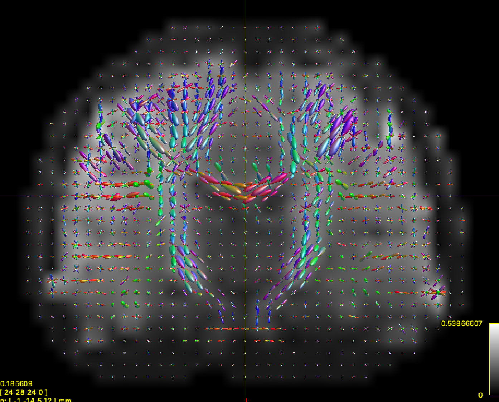
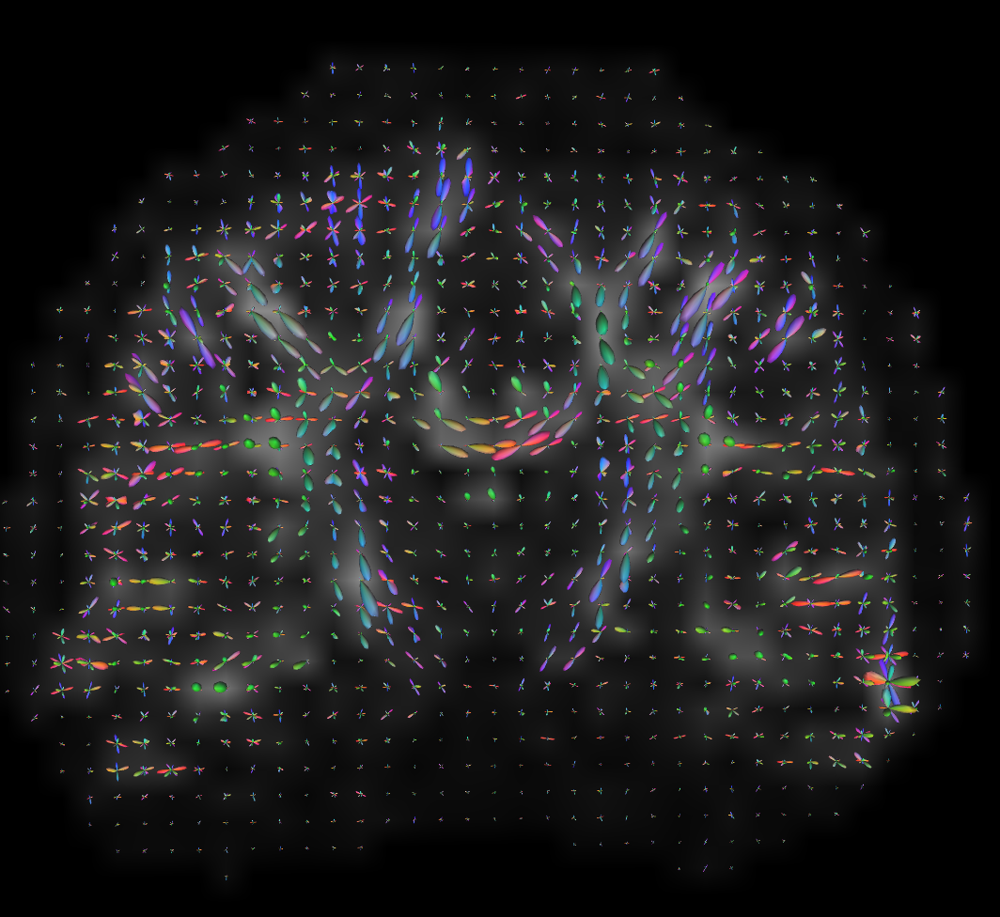
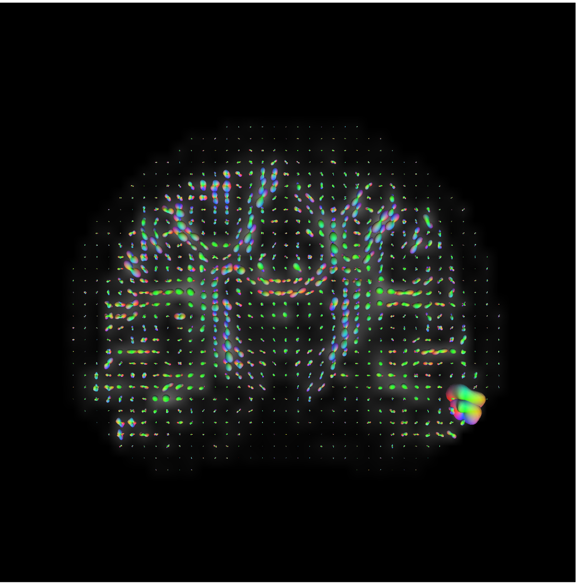
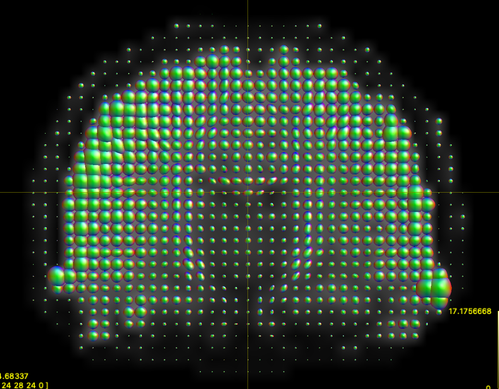
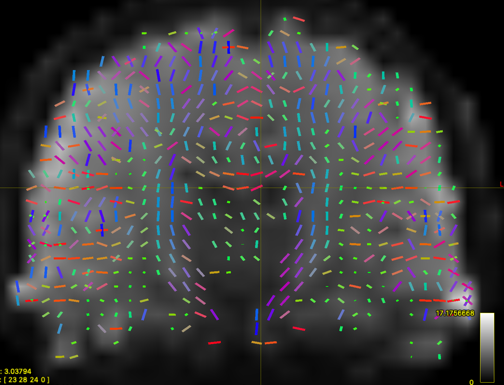

# dmri_convert
Code for converting between MRtrix and DSI Studio. Not a full python package
but a proof of concept.

# MRTrix to DSI Studio

If you ran ``dwi2fod`` and got at ``.mif`` file containing sh coefficients
you can convert to DSI Studio's fib format if you also have a mask file

## Example

Here is a heavily downsampled ABCD-style scan reconstructed with CSD:


running

```python
from mrtrix_to_dsistudio import mrtrix_to_dsistudio
mrtrix_to_dsistudio("input_sh.mif", "input_sh_mask.nii.gz", "test.fib")
```

results in very nice-looking ODFs in DSI Studio:


One cool result is that AFD is stored in the ``fa0``, ``fa1``, etc variables.

# DSI Studio to MRTrix

You can reconstruct in DSI Studio and export to a MRTrix ``mif`` file if
you have a mask file in nifti format.

## Example

Here is the same ABCD-style data reconstructed in DSI Studio using GQI
with default parameters:


running

```python
from dsistudio_to_mrtrix import dsistudio_to_mrtrix
dsistudio_to_mrtrix("dmri.src.odf8.f5rec.bal.csfc.gqi.1.25.fib", "input_sh_mask.nii.gz", "from_dsistudio.mif")
```

results in a blobby, but correct rendering of the GQI ODFs in mrview:


This is actually correct -- DSI Studio subtracts the isotropic component
of each ODF before rendering the glyph. There is no need to do this on
CSD data, so MRTrix doesn't implement that feature. We can tell that
orientation has been preserved by running ``fod2fixel`` on the output
of this function:


Another cool result is that the AFD here is actually quantitative anisotropy
from DSI Studio! 
